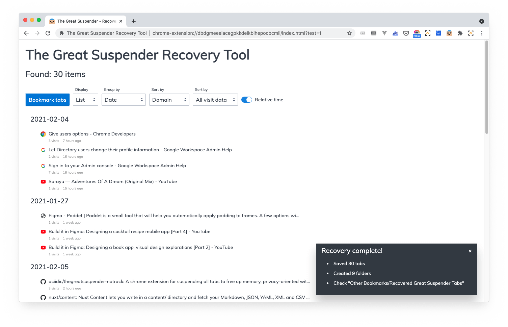

# The Great Suspender Recovery Tool

> Recover your lost Great Suspender tabs!



## Intro

This extension attempts to recover your suspended Great Suspender tabs by searching your browser history and displaying any found suspended tabs.

You can then:

- browse as a [nested list](artwork/screenshot-list.png) or a [table](artwork/screenshot-table.png)
- adjust grouping, sorting and level of detail
- save as [folders and bookmarks](artwork/screenshot-bookmarks.png)
- or copy data to spreadsheet


## Installation

1. Visit the [extension's page](https://chrome.google.com/webstore/detail/great-suspender-recovery/ainlmpkfinfbbgdpimmldfdgpenmclmk) on the Chrome Web Store
2. Click "Add to Chrome"

<!--

### From the Chrome Web Store

1. Visit the extension's [page](https://chrome.google.com/webstore/detail/great-suspender-recovery/ainlmpkfinfbbgdpimmldfdgpenmclmk)
2. Click "Add to Chrome"

> Note that the published version (1.0) is currently 2 minor versions behind the current version (1.3) because of the time it takes to review extensions.
> 
> **Note that all versions will recover your tabs just fine!**
>
> *For the latest version, follow the steps below.*

### Latest version

The latest version contains some minor UI tweaks and more user-friendly information.

You can "side load" this version using the extension page's "developer" settings:

First, download the file:

1. Visit the [latest release page](https://github.com/davestewart/great-suspender-recovery-tool/releases/latest) and click the **Source code (zip)** link
2. Unzip the downloaded file, so it creates its own folder

Next, enable developer mode:

3. Open Chrome and go **Settings > More Tools > Extensions**
4. Toggle on the **Developer mode** switch top right

Finally, load the extension:

5. Click the **Load unpacked** button top left
6. Navigate to the extension's `code/` folder (the one with the `manifest.json` file!)
7. Click to confirm the folder choice

-->

## Instructions

Running the extension:

1. Run the extension by clicking on the toolbar icon: 

Saving as bookmarks:

1. Make sure the "display" option is set to "List"
2. Adjust the settings and preview the output
3. Click "Bookmark Tabs"
4. Check the new folder at "Other Bookmarks/Recovered Great Suspender Tabs"

Copying to a spreadsheet:

1. Make sure the "display" option is set to "Table"
2. Adjust the settings and preview the output
3. Click "Copy to Clipboard"
4. Paste into a spreadsheet


## Are you looking for a new tab manager?

[](http://controlspace.app)

Now that The Great Suspender has been removed from the Chrome Web Store,
perhaps you need a replacement?

[Control Space](http://controlspace.app) is a soon-to-be-released tab manager designed for tab-hoarders and tab-haters alike, which lets you browse, organise, search and switch tabs with one simple shortcut.

It's smooth and fast, yet brimming with features:

- it's an actual, ***actual*** tab manager
- see open, closed and saved tabs **in once place**
- **search and filter** like a boss
- **drag and drop** everything
- completely **keyboard navigable**
- **website integrations** + tools (including sleeping tabs!)
- lots of other **awesome** shit

[Click here to sign up to early access](http://controlspace.app)🤘


## Did you find this tool useful?

An upvote on Product Hunt is always appeciated:

<a href="https://www.producthunt.com/posts/the-great-suspender-recovery-tool?utm_source=badge-featured&utm_medium=badge&utm_souce=badge-the-great-suspender-recovery-tool" target="_blank"></a>

Thank you!


## Development

### Running in test mode

If you don't have any Great Suspender tabs saved, you can check the extension works by adding a manual query to the URL:

```
?text=hello&limit=100
```

### Scripts

The extension is not currently compiled, but there is a build / release process.

To install the packages:

```bash
npm i
```

Before releasing, modify the `src/manifest` version:

```txt
{
  "version": "1.0.0",
}
```


Then run the release script:

```bash
npm run release
```

This will release to a folder called `releases` one level above the repository root.
